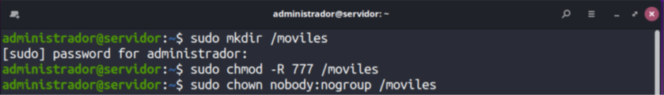
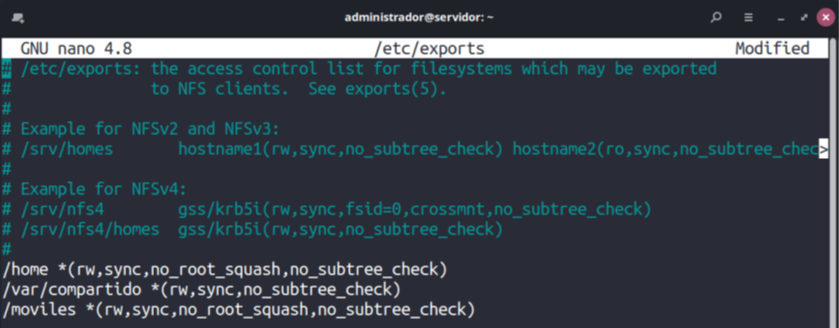
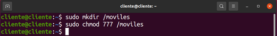
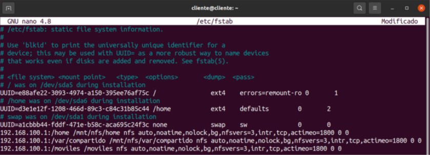
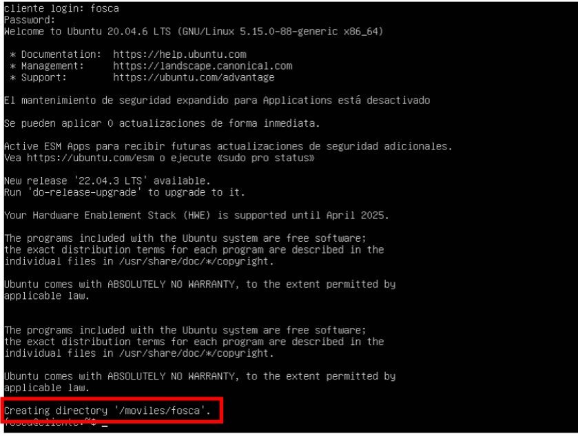

# UD12. Perfiles móviles y LDAP.

## Perfiles móviles de usuario usando NFS Y LDAP.

En muchos contextos de red, las unidades anteriores pueden plantear más dudas que soluciones, ya que un usuario
que trabaje en varios equipos cliente acabará teniendo una carpeta para su perfil en cada uno de los equipos y
**¡su contenido no se sincroniza!** Es decir, si crea un archivo en el cliente A, no lo encontrará en su carpeta cuando inicie
sesión desde el cliente B. **El motivo es que LDAP sólo se encarga de autenticar a los usuarios.**

Sin embargo, en la unidad didáctica 9, aprendimos a compartir datos entre el servidor y los clientes a través de NFS.
En este apartado, aprenderemos a unir las posibilidades de autenticación centralizada en el servidor que ofrece LDAP
con la capacidad de almacenamiento centralizado que aporta NFS. **El resultado serán los perfiles móviles de usuario.**
Es decir, un usuario encontrará su carpeta personal (el equivalente a /home/usuario) en todos los equipos cliente
donde inicie sesión y tendrá en todas el mismo contenido.

Las **tareas** que deberemos completar para resolverlo son estas:

1. **Crear una carpeta en el servidor** para guardar la carpeta /home de los usuarios móviles (el equivalente a
/home/usuario de cada usuario en el servidor). En este ejemplo, en lugar de la carpeta /home crearemos una
específicamente para perfiles móviles a la que llamaremos /moviles.

2. **Modificar el archivo /etc/exports** para compartir el directorio anterior con permisos de lectura/escritura para
todos los usuarios.

3. **Crear una carpeta en los equipos cliente** para montar los perfiles móviles (el equivalente a /home/usuario de
cada usuario en cada cliente). Para este ejemplo, la carpeta de los clientes también se llamará /moviles,
aunque no es necesario que su nombre coincida con el de la carpeta que crearemos para el punto 1.

4. **Modificar el archivo /etc/fstab** de cada cliente para que monte la carpeta que hemos creado en el paso 1 en
el punto de montaje establecido en el paso 3 y reiniciar el equipo.

5. **Modificar las cuentas de usuario LDAP** para indicar que la carpeta donde deben tener su perfil se encuentra
dentro de la carpeta creada en el paso 3 (la que montamos en el cliente).
